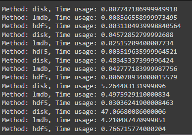
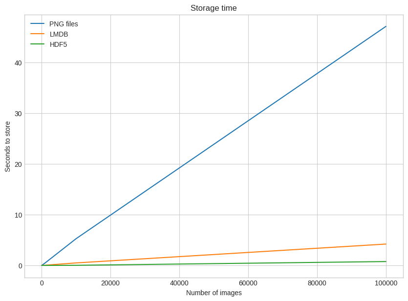
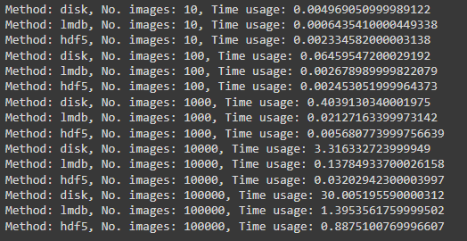
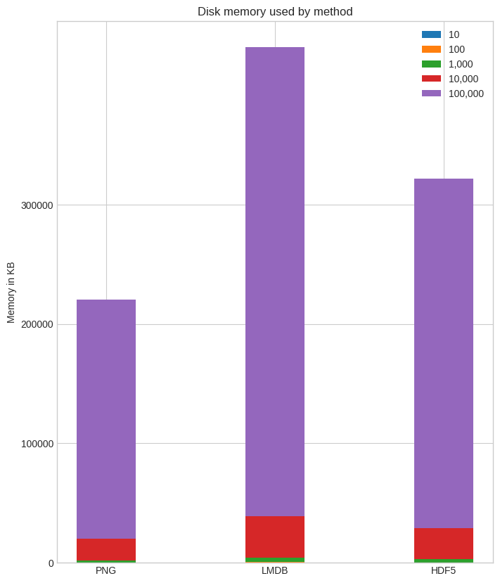

# Three Ways of Storing and Accessing Lots of Images in Python
**SD3203 - Teknologi Basis Data**
---
> Nama  : Andrian Agustinus Lumban Gaol \
> Nim   : 121450090 \
> Kelas : RA
---
<p style="text-align:justify;">Dalam pengolahan gambar skala besar, penting untuk memahami cara menyimpan dan mengakses gambar dalam Python secara efisien. Laporan ini akan menjelaskan berbagai metode penyimpanan gambar mulai dari format file gambar tradisional seperti .png dan .jpg hingga metode alternatif seperti basis data memori-mapped (LMDB) dan format data hierarkis (HDF5). Dengan memahami perbedaan kinerja dan efisiensi penggunaan disk dari setiap metode, kita dapat memilih cara penyimpanan yang paling sesuai untuk tugas pengolahan gambar berskala besar, sehingga dapat mengoptimalkan pengelolaan dataset gambar dan meningkatkan efisiensi keseluruhan.

Pada implementasi ini, digunakan data [CIFAR-10]. Data ini terdiri dari 60.000 gambar dengan 10 kelas, dimana setiap kelasnya diisi 6.000 gambar.

## **Setup Data**
```
import numpy as np
import pickle
from pathlib import Path

# Path to the unzipped CIFAR data
data_dir = Path("/content/drive/MyDrive/cifar-10-batches-py")

# Unpickle function provided by the CIFAR hosts
def unpickle(file):
    with open(file, "rb") as fo:
        dict = pickle.load(fo, encoding="bytes")
    return dict

images, labels = [], []
for batch in data_dir.glob("data_batch_*"):
    batch_data = unpickle(batch)
    for i, flat_im in enumerate(batch_data[b"data"]):
        im_channels = []
        # Each image is flattened, with channels in order of R, G, B
        for j in range(3):
            im_channels.append(
                flat_im[j * 1024 : (j + 1) * 1024].reshape((32, 32))
            )
        # Reconstruct the original image
        images.append(np.dstack((im_channels)))
        # Save the label
        labels.append(batch_data[b"labels"][i])

print("Loaded CIFAR-10 training set:")
print(f" - np.shape(images)     {np.shape(images)}")
print(f" - np.shape(labels)     {np.shape(labels)}")
```
<p style="text-align:justify;">Kode ini membaca data training CIFAR-10 yang telah diunpickle dari beberapa file batch. Untuk setiap batch, kode mengembalikan daftar gambar dan label dari piksel-piksel yang telah diubah kembali ke bentuk gambar 32x32 dengan 3 kanal warna (merah, hijau, biru). Gambar-gambar tersebut disimpan dalam daftar 'images', sementara label-labelnya disimpan dalam daftar 'labels'. Pada akhirnya, kode menampilkan jumlah gambar dan label yang telah dimuat dari keseluruhan data training.


[CIFAR-10]:<https://www.cs.toronto.edu/~kriz/cifar.html>


## **Setup Disk**
1.Disk<br>
```
$ pip install Pillow
```
2.Lmdb<br>
```
$ pip install lmdb
```
3.HDF5<br>
```
$ pip install h5py
```
## **Storing a Single Image**
### Penyimpanan Gambar
```
from pathlib import Path

disk_dir = Path("data/disk/")
lmdb_dir = Path("data/lmdb/")
hdf5_dir = Path("data/hdf5/")
```

```
disk_dir.mkdir(parents=True, exist_ok=True)
lmdb_dir.mkdir(parents=True, exist_ok=True)
hdf5_dir.mkdir(parents=True, exist_ok=True)
```

<p style="text-align:justify;">Kode tersebut membuat struktur direktori untuk menyimpan data dalam tiga format berbeda: disk biasa, LMDB (Lightning Memory-Mapped Database), dan HDF5 (Hierarchical Data Format version 5). Direktori-direktori dibuat menggunakan modul Path dari pathlib, yang memungkinkan pembuatan direktori secara rekursif dan mencegah terjadi kesalahan jika direktori sudah ada sebelumnya. Tujuannya adalah untuk menyiapkan tempat penyimpanan yang terstruktur bagi berbagai jenis data, seperti gambar atau data numerik, untuk keperluan pengolahan data selanjutnya.

### Penyimpanan ke Disk
```
from PIL import Image
import csv

def store_single_disk(image, image_id, label):
    """ Stores a single image as a .png file on disk.
        Parameters:
        ---------------
        image       image array, (32, 32, 3) to be stored
        image_id    integer unique ID for image
        label       image label
    """
    Image.fromarray(image).save(disk_dir / f"{image_id}.png")

    with open(disk_dir / f"{image_id}.csv", "wt") as csvfile:
        writer = csv.writer(
            csvfile, delimiter=" ", quotechar="|", quoting=csv.QUOTE_MINIMAL
        )
        writer.writerow([label])
```
 <p style="text-align:justify;"> Kode ini mendefinisikan fungsi `store_single_disk` yang menyimpan gambar dalam format PNG dan labelnya dalam format CSV di disk. Gambar disimpan menggunakan modul PIL dengan nama file berdasarkan `image_id` yang diberikan. Label disimpan dalam file CSV terpisah dengan nama yang sama dengan gambar, tetapi dengan ekstensi `.csv`. Fungsi ini menerima tiga parameter: `image` (array gambar 32x32x3), `image_id` (ID unik untuk gambar), dan `label` (label gambar). Fungsi ini memudahkan penyimpanan gambar dan labelnya dalam format yang umum digunakan di disk.

### Penyimpanan ke LDBM
```
class CIFAR_Image:
    def __init__(self, image, label):
        # Dimensions of image for reconstruction - not really necessary 
        # for this dataset, but some datasets may include images of 
        # varying sizes
        self.channels = image.shape[2]
        self.size = image.shape[:2]

        self.image = image.tobytes()
        self.label = label

    def get_image(self):
        """ Returns the image as a numpy array. """
        image = np.frombuffer(self.image, dtype=np.uint8)
        return image.reshape(*self.size, self.channels)
```
```
import lmdb
import pickle

def store_single_lmdb(image, image_id, label):
    """ Stores a single image to a LMDB.
        Parameters:
        ---------------
        image       image array, (32, 32, 3) to be stored
        image_id    integer unique ID for image
        label       image label
    """
    map_size = image.nbytes * 10

    # Create a new LMDB environment
    env = lmdb.open(str(lmdb_dir / f"single_lmdb"), map_size=map_size)

    # Start a new write transaction
    with env.begin(write=True) as txn:
        # All key-value pairs need to be strings
        value = CIFAR_Image(image, label)
        key = f"{image_id:08}"
        txn.put(key.encode("ascii"), pickle.dumps(value))
    env.close()
```
<p style="text-align:justify;"> Kode ini mendefinisikan kelas `CIFAR_Image` yang digunakan untuk menyimpan gambar dan labelnya dalam format yang dapat disimpan ke LMDB (Lightning Memory-Mapped Database). Kelas ini memiliki metode `get_image()` yang mengembalikan gambar dalam bentuk array NumPy. Selanjutnya, ada fungsi `store_single_lmdb()` yang digunakan untuk menyimpan satu gambar dan labelnya ke dalam LMDB. Fungsi ini membuat lingkungan LMDB baru dengan ukuran tertentu, kemudian melakukan transaksi penulisan untuk menyimpan gambar dan label sebagai pasangan kunci-nilai dalam LMDB, dengan kunci berupa ID gambar dalam format string 8 karakter dan nilai berupa objek `CIFAR_Image` yang telah di-pickle.

### Menyimpan dengan HDF5
```
import h5py

def store_single_hdf5(image, image_id, label):
    """ Stores a single image to an HDF5 file.
        Parameters:
        ---------------
        image       image array, (32, 32, 3) to be stored
        image_id    integer unique ID for image
        label       image label
    """
    # Create a new HDF5 file
    file = h5py.File(hdf5_dir / f"{image_id}.h5", "w")

    # Create a dataset in the file
    dataset = file.create_dataset(
        "image", np.shape(image), h5py.h5t.STD_U8BE, data=image
    )
    meta_set = file.create_dataset(
        "meta", np.shape(label), h5py.h5t.STD_U8BE, data=label
    )
    file.close()
```
<p style="text-align:justify;"> Kode ini mendefinisikan fungsi `store_single_hdf5()` yang digunakan untuk menyimpan satu gambar dan labelnya ke dalam file HDF5 (Hierarchical Data Format versi 5). Fungsi ini menerima tiga parameter: `image` (array gambar 32x32x3), `image_id` (ID unik untuk gambar), dan `label` (label gambar). Fungsi membuat file HDF5 baru dengan nama berdasarkan `image_id`. Kemudian, fungsi membuat dua dataset di dalam file HDF5, satu dataset untuk menyimpan gambar dan satu dataset untuk menyimpan label (meta data). Dataset gambar disimpan dengan tipe data `h5py.h5t.STD_U8BE` (unsigned 8-bit integer) dan dataset label juga disimpan dengan tipe data yang sama. Setelah data disimpan, file HDF5 ditutup.

### Menyimpan Satu Gambar
```
_store_single_funcs = dict(
    disk=store_single_disk, lmdb=store_single_lmdb, hdf5=store_single_hdf5
)
```
```
from timeit import timeit

store_single_timings = dict()

for method in ("disk", "lmdb", "hdf5"):
    t = timeit(
        "_store_single_funcs[method](image, 0, label)",
        setup="image=images[0]; label=labels[0]",
        number=1,
        globals=globals(),
    )
    store_single_timings[method] = t
    print(f"Method: {method}, Time usage: {t}")
```

<p style="text-align:justify;"> Kode ini bertujuan untuk mengukur waktu yang dibutuhkan dalam menyimpan satu gambar dan labelnya dengan menggunakan tiga metode penyimpanan berbeda, yaitu disk, LMDB (Lightning Memory-Mapped Database), dan HDF5 (Hierarchical Data Format versi 5). Pertama, kode mendefinisikan sebuah dictionary `_store_single_funcs` yang memetakan nama metode penyimpanan dengan fungsi yang sesuai untuk menyimpan satu gambar dan labelnya.

<p style="text-align:justify;"> Selanjutnya, kode menggunakan modul `timeit` dari Python untuk mengukur waktu yang dibutuhkan dalam memanggil fungsi penyimpanan pada setiap metode. Perulangan dilakukan untuk setiap metode penyimpanan, dan pada setiap iterasi, `timeit` memanggil fungsi penyimpanan dengan gambar pertama dari dataset (`images[0]`) dan label pertama (`labels[0]`). Jumlah pengulangan diatur menjadi 1. Waktu yang dibutuhkan untuk setiap metode penyimpanan disimpan dalam dictionary `store_single_timings`, dan hasilnya dicetak dengan menampilkan metode dan waktu yang dibutuhkan. Kode ini membantu membandingkan kinerja dari ketiga metode penyimpanan untuk operasi menyimpan satu gambar dan labelnya.

## **Storing Many Images**
### Menyimpan Banyak Gambar
```
store_many_disk(images, labels):
    """ Stores an array of images to disk
        Parameters:
        ---------------
        images       images array, (N, 32, 32, 3) to be stored
        labels       labels array, (N, 1) to be stored
    """
    num_images = len(images)

    # Save all the images one by one
    for i, image in enumerate(images):
        Image.fromarray(image).save(disk_dir / f"{i}.png")

    # Save all the labels to the csv file
    with open(disk_dir / f"{num_images}.csv", "w") as csvfile:
        writer = csv.writer(
            csvfile, delimiter=" ", quotechar="|", quoting=csv.QUOTE_MINIMAL
        )
        for label in labels:
            # This typically would be more than just one value per row
            writer.writerow([label])

def store_many_lmdb(images, labels):
    """ Stores an array of images to LMDB.
        Parameters:
        ---------------
        images       images array, (N, 32, 32, 3) to be stored
        labels       labels array, (N, 1) to be stored
    """
    num_images = len(images)

    map_size = num_images * images[0].nbytes * 10

    # Create a new LMDB DB for all the images
    env = lmdb.open(str(lmdb_dir / f"{num_images}_lmdb"), map_size=map_size)

    # Same as before — but let's write all the images in a single transaction
    with env.begin(write=True) as txn:
        for i in range(num_images):
            # All key-value pairs need to be Strings
            value = CIFAR_Image(images[i], labels[i])
            key = f"{i:08}"
            txn.put(key.encode("ascii"), pickle.dumps(value))
    env.close()

def store_many_hdf5(images, labels):
    """ Stores an array of images to HDF5.
        Parameters:
        ---------------
        images       images array, (N, 32, 32, 3) to be stored
        labels       labels array, (N, 1) to be stored
    """
    num_images = len(images)

    # Create a new HDF5 file
    file = h5py.File(hdf5_dir / f"{num_images}_many.h5", "w")

    # Create a dataset in the file
    dataset = file.create_dataset(
        "images", np.shape(images), h5py.h5t.STD_U8BE, data=images
    )
    meta_set = file.create_dataset(
        "meta", np.shape(labels), h5py.h5t.STD_U8BE, data=labels
    )
    file.close()
```
<p style="text-align:justify;"> Fungsi-fungsi ini bertujuan untuk menyimpan array gambar dan label ke penyimpanan yang berbeda, yaitu disk, LMDB (Lightning Memory-Mapped Database), dan HDF5 (Hierarchical Data Format version 5). Fungsi `store_many_disk` menyimpan gambar-gambar dalam format .png secara berurutan ke dalam direktori disk, sementara label-label disimpan dalam file .csv. Fungsi `store_many_lmdb` menggunakan LMDB untuk menyimpan gambar dan label dalam satu transaksi, dengan setiap pasangan gambar-label diwakilkan sebagai nilai dan kunci (key-value pairs). Sedangkan fungsi `store_many_hdf5` menggunakan HDF5 untuk menyimpan gambar dan label dalam satu file, dengan gambar disimpan dalam dataset "images" dan label disimpan dalam dataset "meta". Melalui fungsi-fungsi ini, kita dapat menyimpan dataset gambar dengan efisien dalam berbagai format penyimpanan yang sesuai dengan kebutuhan aplikasi.

### Menyiapkan Data Set
```
cutoffs = [10, 100, 1000, 10000, 100000]

# Let's double our images so that we have 100,000
images = np.concatenate((images, images), axis=0)
labels = np.concatenate((labels, labels), axis=0)

# Make sure you actually have 100,000 images and labels
print(np.shape(images))
print(np.shape(labels))
```
<p style="text-align:justify;"> Kode ini bertujuan untuk menggandakan jumlah gambar dan label dalam dataset dengan menambahkan dataset gambar dan label yang sama ke dalam dirinya sendiri. Ini dilakukan dengan menggunakan fungsi `np.concatenate()` untuk menggabungkan dua array secara berurutan pada sumbu yang ditentukan, sehingga jumlah gambar dan label menjadi dua kali lipat dari sebelumnya. Variabel `cutoffs` menentukan batas jumlah gambar yang akan digunakan dalam percobaan berikutnya. Dalam contoh ini, jumlah gambar dan label akan digandakan menjadi 100.000. Melalui pemrosesan ini, kita mempersiapkan dataset yang lebih besar untuk menguji dan membandingkan kinerja dari berbagai metode penyimpanan gambar.

### Waktu Penyimpanan Banyak Gambar
```
_store_many_funcs = dict(
    disk=store_many_disk, lmdb=store_many_lmdb, hdf5=store_many_hdf5
)

from timeit import timeit

store_many_timings = {"disk": [], "lmdb": [], "hdf5": []}

for cutoff in cutoffs:
    for method in ("disk", "lmdb", "hdf5"):
        t = timeit(
            "_store_many_funcs[method](images_, labels_)",
            setup="images_=images[:cutoff]; labels_=labels[:cutoff]",
            number=1,
            globals=globals(),
        )
        store_many_timings[method].append(t)

        # Print out the method, cutoff, and elapsed time
        print(f"Method: {method}, Time usage: {t}")
```


<p style="text-align:justify;"> Untuk menyimpan banyak gambar menggunakan tiga metode penyimpanan yang berbeda, yaitu disk, LMDB (Lightning Memory-Mapped Database), dan HDF5 (Hierarchical Data Format version 5), dilakukan pengukuran waktu eksekusi dengan menggunakan modul timeit. Pengukuran waktu dilakukan untuk setiap metode dan jumlah data tertentu, dengan hasil waktu eksekusi dicatat dalam dictionary. Melalui iterasi nilai-nilai dalam cutoffs, yang menentukan jumlah data yang akan disimpan, waktu eksekusi untuk setiap metode penyimpanan dapat diamati. Hasil output menunjukkan bahwa waktu eksekusi meningkat seiring dengan peningkatan jumlah data, dengan metode penyimpanan disk membutuhkan waktu paling lama, sementara LMDB dan HDF5 cenderung lebih cepat, terutama saat jumlah data semakin besar. Dengan demikian, pemilihan metode penyimpanan dapat memengaruhi kinerja dan waktu eksekusi dalam menyimpan banyak gambar.

### Grafik Penyimpanan Banyak Gambar
```
import matplotlib.pyplot as plt

def plot_with_legend(
    x_range, y_data, legend_labels, x_label, y_label, title, log=False
):
    """ Displays a single plot with multiple datasets and matching legends.
        Parameters:
        --------------
        x_range         list of lists containing x data
        y_data          list of lists containing y values
        legend_labels   list of string legend labels
        x_label         x axis label
        y_label         y axis label
    """
    plt.style.use("seaborn-whitegrid")
    plt.figure(figsize=(10, 7))

    if len(y_data) != len(legend_labels):
        raise TypeError(
            "Error: number of data sets does not match number of labels."
        )

    all_plots = []
    for data, label in zip(y_data, legend_labels):
        if log:
            temp, = plt.loglog(x_range, data, label=label)
        else:
            temp, = plt.plot(x_range, data, label=label)
        all_plots.append(temp)

    plt.title(title)
    plt.xlabel(x_label)
    plt.ylabel(y_label)
    plt.legend(handles=all_plots)
    plt.show()

# Getting the store timings data to display
disk_x = store_many_timings["disk"]
lmdb_x = store_many_timings["lmdb"]
hdf5_x = store_many_timings["hdf5"]

plot_with_legend(
    cutoffs,
    [disk_x, lmdb_x, hdf5_x],
    ["PNG files", "LMDB", "HDF5"],
    "Number of images",
    "Seconds to store",
    "Storage time",
    log=False,
)

plot_with_legend(
    cutoffs,
    [disk_x, lmdb_x, hdf5_x],
    ["PNG files", "LMDB", "HDF5"],
    "Number of images",
    "Seconds to store",
    "Log storage time",
    log=True,
)
```
)


<p style="text-align:justify;"> Grafik menunjukkan bahwa menyimpan gambar dalam format PNG merupakan metode yang paling lambat, sementara LMDB dan HDF5 jauh lebih cepat. Meskipun untuk jumlah gambar kecil, HDF5 sedikit lebih cepat dari LMDB, namun untuk jumlah gambar yang lebih besar, LMDB menjadi lebih cepat daripada HDF5. Dengan demikian, secara keseluruhan, LMDB terlihat menjadi cara yang paling efisien untuk menyimpan sejumlah besar gambar dari ketiga metode yang disajikan dalam grafik.

## **Reading a Single Image**
### Membaca Dari Disk
```
def read_single_disk(image_id):
    """ Stores a single image to disk.
        Parameters:
        ---------------
        image_id    integer unique ID for image

        Returns:
        ----------
        image       image array, (32, 32, 3) to be stored
        label       associated meta data, int label
    """
    image = np.array(Image.open(disk_dir / f"{image_id}.png"))

    with open(disk_dir / f"{image_id}.csv", "r") as csvfile:
        reader = csv.reader(
            csvfile, delimiter=" ", quotechar="|", quoting=csv.QUOTE_MINIMAL
        )
        label = int(next(reader)[0])

    return image, label
```

<p style="text-align:justify;"> Fungsi read_single_disk bertujuan untuk membaca sebuah gambar dan label terkait yang disimpan dalam penyimpanan disk. Pertama, gambar dibaca dari file .png menggunakan modul PIL (Python Imaging Library) dan dikonversi menjadi array numpy. Selanjutnya, label yang terkait dengan gambar tersebut dibaca dari file .csv yang sesuai dengan menggunakan modul csv. Hasilnya adalah sebuah tuple yang berisi array gambar dan label, yang kemudian dikembalikan sebagai output fungsi. Dengan menggunakan fungsi ini, kita dapat membaca gambar dan label yang disimpan dalam format disk dengan mudah dan efisien.

### Membaca dari LMDB
```
def read_single_lmdb(image_id):
    """ Stores a single image to LMDB.
        Parameters:
        ---------------
        image_id    integer unique ID for image

        Returns:
        ----------
        image       image array, (32, 32, 3) to be stored
        label       associated meta data, int label
    """
    # Open the LMDB environment
    env = lmdb.open(str(lmdb_dir / f"single_lmdb"), readonly=True)

    # Start a new read transaction
    with env.begin() as txn:
        # Encode the key the same way as we stored it
        data = txn.get(f"{image_id:08}".encode("ascii"))
        # Remember it's a CIFAR_Image object that is loaded
        cifar_image = pickle.loads(data)
        # Retrieve the relevant bits
        image = cifar_image.get_image()
        label = cifar_image.label
    env.close()

    return image, label
```
<p style="text-align:justify;"> Fungsi `read_single_lmdb` berfungsi untuk membaca sebuah gambar dan label terkait yang disimpan dalam LMDB (Lightning Memory-Mapped Database). Pertama, lingkungan LMDB dibuka dalam mode hanya baca (readonly). Kemudian, transaksi baca baru dimulai, dan gambar serta label yang sesuai dengan `image_id` ditemukan dengan menggunakan kunci yang sesuai dengan format yang sama seperti saat disimpan. Data gambar dan label kemudian diambil dari objek CIFAR_Image yang telah disimpan dan dikembalikan sebagai output fungsi. Dengan menggunakan fungsi ini, kita dapat membaca gambar dan label dari LMDB dengan mudah dan efisien.

### Membaca dari HDF5
```
def read_single_hdf5(image_id):
    """ Stores a single image to HDF5.
        Parameters:
        ---------------
        image_id    integer unique ID for image

        Returns:
        ----------
        image       image array, (32, 32, 3) to be stored
        label       associated meta data, int label
    """
    # Open the HDF5 file
    file = h5py.File(hdf5_dir / f"{image_id}.h5", "r+")

    image = np.array(file["/image"]).astype("uint8")
    label = int(np.array(file["/meta"]).astype("uint8"))

    return image, label
```
```
_read_single_funcs = dict(
    disk=read_single_disk, lmdb=read_single_lmdb, hdf5=read_single_hdf5
)
```
<p style="text-align:justify;"> Fungsi `read_single_hdf5` bertujuan untuk membaca sebuah gambar dan label terkait yang disimpan dalam format HDF5 (Hierarchical Data Format version 5). Pertama, file HDF5 dibuka untuk membaca (mode "r+"). Kemudian, array gambar dan label diambil dari dataset yang sesuai di dalam file HDF5 menggunakan modul h5py. Data gambar dan label kemudian dikembalikan sebagai output fungsi. Selain itu, terdapat juga dictionary `_read_single_funcs` yang memetakan nama metode penyimpanan ke fungsi yang sesuai untuk membaca data dari setiap metode penyimpanan yang digunakan. Dengan menggunakan fungsi ini dan dictionary yang terkait, kita dapat membaca gambar dan label dari format HDF5 dengan mudah dan efisien.

## **Reading Many Images**
```
def read_many_disk(num_images):
    """ Reads image from disk.
        Parameters:
        ---------------
        num_images   number of images to read

        Returns:
        ----------
        images      images array, (N, 32, 32, 3) to be stored
        labels      associated meta data, int label (N, 1)
    """
    images, labels = [], []

    # Loop over all IDs and read each image in one by one
    for image_id in range(num_images):
        images.append(np.array(Image.open(disk_dir / f"{image_id}.png")))

    with open(disk_dir / f"{num_images}.csv", "r") as csvfile:
        reader = csv.reader(
            csvfile, delimiter=" ", quotechar="|", quoting=csv.QUOTE_MINIMAL
        )
        for row in reader:
            labels.append(int(row[0]))
    return images, labels

def read_many_lmdb(num_images):
    """ Reads image from LMDB.
        Parameters:
        ---------------
        num_images   number of images to read

        Returns:
        ----------
        images      images array, (N, 32, 32, 3) to be stored
        labels      associated meta data, int label (N, 1)
    """
    images, labels = [], []
    env = lmdb.open(str(lmdb_dir / f"{num_images}_lmdb"), readonly=True)

    # Start a new read transaction
    with env.begin() as txn:
        # Read all images in one single transaction, with one lock
        # We could split this up into multiple transactions if needed
        for image_id in range(num_images):
            data = txn.get(f"{image_id:08}".encode("ascii"))
            # Remember that it's a CIFAR_Image object 
            # that is stored as the value
            cifar_image = pickle.loads(data)
            # Retrieve the relevant bits
            images.append(cifar_image.get_image())
            labels.append(cifar_image.label)
    env.close()
    return images, labels

def read_many_hdf5(num_images):
    """ Reads image from HDF5.
        Parameters:
        ---------------
        num_images   number of images to read

        Returns:
        ----------
        images      images array, (N, 32, 32, 3) to be stored
        labels      associated meta data, int label (N, 1)
    """
    images, labels = [], []

    # Open the HDF5 file
    file = h5py.File(hdf5_dir / f"{num_images}_many.h5", "r+")

    images = np.array(file["/images"]).astype("uint8")
    labels = np.array(file["/meta"]).astype("uint8")

    return images, labels

_read_many_funcs = dict(
    disk=read_many_disk, lmdb=read_many_lmdb, hdf5=read_many_hdf5
)
```
<p style="text-align:justify;"> Fungsi `read_many_disk`, `read_many_lmdb`, dan `read_many_hdf5` bertujuan untuk membaca banyak gambar beserta label terkait dari penyimpanan disk, LMDB (Lightning Memory-Mapped Database), dan HDF5 (Hierarchical Data Format version 5) secara berturut-turut. Masing-masing fungsi membaca jumlah gambar yang ditentukan (`num_images`), kemudian mengembalikan array gambar dan array label yang sesuai. Fungsi-fungsi ini menggunakan modul PIL (Python Imaging Library) untuk membaca gambar dari disk dalam format PNG, modul lmdb untuk membaca data dari LMDB, dan modul h5py untuk membaca data dari format HDF5. Selain itu, terdapat dictionary `_read_many_funcs` yang memetakan nama metode penyimpanan ke fungsi yang sesuai untuk membaca banyak data dari setiap metode penyimpanan yang digunakan. Dengan menggunakan fungsi-fungsi ini dan dictionary yang terkait, kita dapat membaca banyak gambar dan label dari berbagai format penyimpanan dengan mudah dan efisien.

### Waktu Penyimpanan Banyak Gambar
```
from timeit import timeit

read_many_timings = {"disk": [], "lmdb": [], "hdf5": []}

for cutoff in cutoffs:
    for method in ("disk", "lmdb", "hdf5"):
        t = timeit(
            "_read_many_funcs[method](num_images)",
            setup="num_images=cutoff",
            number=1,
            globals=globals(),
        )
        read_many_timings[method].append(t)

        # Print out the method, cutoff, and elapsed time
        print(f"Method: {method}, No. images: {cutoff}, Time usage: {t}")
```


### Grafik Penyimpanan Banyak Gambar
```
# Memory used in KB
disk_mem = [24, 204, 2004, 20032, 200296]
lmdb_mem = [60, 420, 4000, 39000, 393000]
hdf5_mem = [36, 304, 2900, 29000, 293000]

X = [disk_mem, lmdb_mem, hdf5_mem]

ind = np.arange(3)
width = 0.35

plt.subplots(figsize=(8, 10))
plots = [plt.bar(ind, [row[0] for row in X], width)]
for i in range(1, len(cutoffs)):
    plots.append(
        plt.bar(
            ind, [row[i] for row in X], width, bottom=[row[i - 1] for row in X]
        )
    )

plt.ylabel("Memory in KB")
plt.title("Disk memory used by method")
plt.xticks(ind, ("PNG", "LMDB", "HDF5"))
plt.yticks(np.arange(0, 400000, 100000))

plt.legend(
    [plot[0] for plot in plots], ("10", "100", "1,000", "10,000", "100,000")
)
plt.show()
```
<p style="text-align:justify;"> Kode ini bertujuan untuk membuat sebuah grafik batang yang membandingkan penggunaan memori untuk tiga metode penyimpanan yang berbeda, yaitu disk, LMDB (Lightning Memory-Mapped Database), dan HDF5 (Hierarchical Data Format version 5). Data penggunaan memori untuk setiap metode dan jumlah data tertentu disimpan dalam tiga list terpisah: `disk_mem`, `lmdb_mem`, dan `hdf5_mem`. Grafik batang tersebut menampilkan penggunaan memori dalam kilobita (KB) untuk setiap metode, dengan sumbu-x mewakili nama metode penyimpanan, dan sumbu-y menunjukkan jumlah memori dalam KB. Setiap grup batang pada sumbu-x mewakili penggunaan memori untuk masing-masing metode pada setiap nilai cutoff yang ditentukan dalam list `cutoffs`. Dengan visualisasi grafik ini, kita dapat membandingkan dan memahami perbedaan penggunaan memori antara ketiga metode penyimpanan untuk berbagai jumlah data.


<p style="text-align:justify;"> Berdasarkan grafik, dapat dilihat bahwa LMDB menggunakan memori disk yang signifikan lebih tinggi dibandingkan dengan PNG dan HDF5 untuk semua jumlah data. HDF5 memiliki penggunaan memori yang sedang, berada di antara LMDB dan PNG. Sementara itu, PNG memiliki penggunaan memori yang paling rendah di antara ketiganya. Ini menunjukkan bahwa pemilihan metode penyimpanan dapat mempengaruhi penggunaan memori disk, dengan LMDB menjadi yang paling memakan memori, diikuti oleh HDF5, dan PNG memiliki penggunaan memori yang paling efisien.